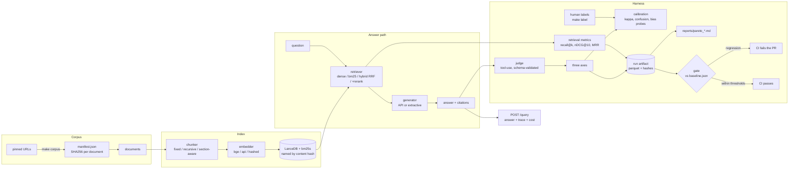

# evalgate

A RAG system over EU CBAM regulatory documents. The RAG part is deliberately
boring. What I actually built is the harness around it: an LLM judge whose
agreement with human labels is measured rather than assumed, a
54-configuration retrieval sweep on a cost/latency/quality frontier,
and a CI gate that fails a pull request when quality drops.

The frozen baseline scores 0.828 composite quality at 11.4 ms p95,
with a projected 0.01047 dollars per query. The judge agrees with my
labels at a Cohen's kappa of 0.800 groundedness / 0.348 relevance / 0.348 citation correctness across the three axes.
That spread is the interesting part, and I break it down below.

Most RAG projects I have read optimise the retriever and then guess at whether
it got better. This one is the other way round.

> Before you read the numbers: the ablation frontier ran on a synthetic corpus,
> with the rule-based judge and the extractive generator, because I built it in
> an environment that could reach neither the EU document servers nor an API
> key (D-0009 in the decision log). The calibration section is different - its
> headline scores came from a real LLM judge. A different judge is a different
> instrument, so those numbers and the frontier's are never put in one table
> (D-0051), and the runs an LLM judged are reported on their own. The
> harness is real and the numbers are real measurements; what they measure is
> weaker than what this is designed to run on. Every substitution is a config
> flag with its cost written down. The README itself is rendered from the
> artifacts by `make readme`, so no number in it was typed by hand.

## On the real regulation

The harness also runs on the real instruments: 5 documents --
Regulation (EU) 2023/956, Implementing Regulation (EU) 2023/1773, the
Commission's two guidance documents and the ETS directive -- fetched from their
pinned URLs and checked byte for byte against the SHA256s in
`data/corpus/manifest.json` (corpus hash `ab0fc00c7468`). The PDFs are
not committed; `make corpus PROFILE="+experiment=real"` reproduces them.

They are scored on 28 retrieval questions and
12 answer examples in `data/eval/cbam/`, every gold span
checked verbatim against the extracted text. The questions were drafted from
the documents and accepted in a review the repository owner delegated rather
than did, and every record says so (D-0060).

Pull-request CI gates this corpus too, offline: BM25 at
`recursive_structural/bm25/k=10`, the extractive generator and the rule-based judge,
held to `baseline.real.json` -- composite 0.792, recall@k
0.750, p95 0.4 ms. BM25 needs no embedding model, so the
job installs no torch; it caches the documents between runs and refuses as
incomparable if one fails to fetch.

54 configurations measured on the real corpus, dense and hybrid
under both the hashed embedder and bge-small, plus the cross-encoder reranker
([`reports/pareto_cbam.md`](reports/pareto_cbam.md)):

|  | config | quality | recall@k | nDCG@10 | p95 ms | projected $/q |
| --- | --- | --- | --- | --- | --- | --- |
| * | section/hybrid_rerank/k=10 | 0.846 | 0.929 | 0.805 | 8861.2 | 0.014434 |
| * | section/hybrid_rerank/k=5 | 0.826 | 0.893 | 0.792 | 9163.5 | 0.008718 |
| * | section/hybrid/k=10/local | 0.821 | 0.857 | 0.647 | 31.1 | 0.013603 |
|  | recursive/hybrid/k=10/local | 0.818 | 0.893 | 0.713 | 32.0 | 0.011347 |
|  | fixed/hybrid/k=10/local | 0.818 | 0.786 | 0.644 | 34.4 | 0.011154 |
| * | recursive/hybrid/k=5/local | 0.812 | 0.893 | 0.713 | 32.3 | 0.006932 |
|  | recursive/hybrid_rerank/k=10 | 0.812 | 0.893 | 0.693 | 5494.5 | 0.010967 |
|  | recursive/dense/k=10/local | 0.811 | 0.857 | 0.707 | 32.5 | 0.011108 |

The three judges against the answer labels on this corpus
([`reports/judge_calibration_cbam.md`](reports/judge_calibration_cbam.md)).
Those labels are delegated, not an independent person's, so this says how
consistently each judge and the rubric line up, not how a person would rate the
answers:

| judge | retriever | embedder | n | kappa groundedness | kappa relevance | kappa citation_correctness |
| --- | --- | --- | --- | --- | --- | --- |
| `qwen/qwen3.8-27b` | hybrid (k=8) | local / BAAI/bge-small-en-v1.5 | 12 | 0.341 | 0.333 | 0.676 |
| `rule-based-v1` | hybrid (k=8) | local / BAAI/bge-small-en-v1.5 | 12 | -0.043 | 0.091 | 0.176 |
| `rule-based-v2` | hybrid (k=8) | local / BAAI/bge-small-en-v1.5 | 12 | -0.043 | 0.091 | 0.200 |

Each judge scored the answers against context from its own retrieval stack. Where the stacks differ, so did what the judges were shown, and the gap between two rows is not only a difference between judges.

All three scored the same twelve answers over the same retrieval stack, so the
rows differ only by judge. The LLM judge, `qwen/qwen3.8-27b` on Groq's free tier,
is the only one that tracks the rubric closely on real regulatory prose: citation
correctness at 0.676 against
0.200 for the better rule, and
groundedness at 0.341 where both rules
sit at -0.043. Its error runs the other way
from the synthetic corpus: its mean citation score minus the labels' is
-0.500, stricter rather than more generous.
Reversing the order of the retrieved context changed groundedness on 3 of 12, relevance on 2 of 12 answers and no other score. At twelve
items a single answer moves kappa noticeably, and the labels are delegated, so
this ranks the instruments rather than validating any of them (D-0063).

The live stack on this corpus is frozen too: `recursive_structural/hybrid/k=8` over
bge-small, `openai/gpt-oss-20b` answering and `qwen/qwen3.8-27b` judging,
held to `baseline.live_groq.json` -- composite 0.881, recall@k
0.893, judge means 4.58 groundedness,
4.67 relevance and 4.33 citation
correctness over 12 answers. It is what the nightly job
gates against when `EVALGATE_LIVE_PROFILE` is `+experiment=live_groq`.

## Architecture



Data flows one way. Nothing downstream writes upstream.

## Reproduce in 60 seconds

No network, no API key, no model download:

```bash
make dev          # uv sync, Python 3.12
make check        # ruff format + lint, mypy strict, pytest
make eval         # the quality gate against baseline.json -> exit 0
make gate-demo    # degrade the retriever, prove the gate blocks it, restore
```

`make gate-demo` is the one to watch. It drops `retriever.k` to 1, asserts the
gate fails, restores the baseline configuration, asserts it passes, and exits
nonzero if either expectation is wrong.

The rest of the pipeline, same conditions:

```bash
make ingest       # corpus -> chunks
make index        # LanceDB + bm25s, a no-op if nothing changed
make ablate       # sweep the config matrix, one immutable run each
make judge        # score the answer eval set
make report       # regenerate reports/ from the run artifacts
make label        # rate answers on three axes; resumable, loses nothing
make serve        # the query UI and POST /query on :8000
```

For the real system -- real documents, bge embeddings, API generator and judge:

```bash
make ml                                    # sentence-transformers + torch
make corpus PROFILE="+experiment=live"     # fetch and pin the EU sources by SHA256
export ANTHROPIC_API_KEY=...               # or GROQ_API_KEY and +experiment=live_groq
make freeze PROFILE="+experiment=live"     # once, deliberately
make eval PROFILE="+experiment=live"
```

The real documents have their own eval set in `data/eval/cbam/`: gold evidence
is a verbatim span of the corpus it came from, so the synthetic questions
cannot be scored against the regulation, and the runner refuses to try rather
than report the resulting zeros as a measurement (D-0050).
`make label PROFILE="+experiment=live" ARGS="label.mode=retrieval"` re-reviews
the questions and `make label PROFILE="+experiment=live"` labels the answers.

Always pass a profile as `PROFILE`, never inside `ARGS`: the Makefile already
passes one, and two `+experiment` values do not compose.

## Serving it

`make serve` starts a FastAPI process and opens <http://localhost:8000> on a
query interface: ask a question, get the answer with every `[chunk#id]` marker
rendered as a button that scrolls to the passage it cites. Each citation is
labelled `verified` or `unsupported` by the same audit the evaluation uses, so
a fabricated citation is visible in the interface rather than only in a report.
The retrieval trace, token counts, latency split and the corpus, index, prompt
and config hashes are all on the page.

The API is unchanged and remains the contract: `GET /health` for readiness and
what the process is serving, `POST /query` for an answer with its trace. The UI
is a client of that endpoint and adds nothing to the answer path -- a serving
layer that reranked or rewrote queries on its own would be a different system
from the one the frontier below describes, and the frontier would quietly stop
being true.

`make serve` and the container both serve the frozen offline stack by default,
so they start with no model download and no key. The deployment switches are
environment variables, all off by default because the harness and the test
suite want none of them:

| variable | effect |
| --- | --- |
| `EVALGATE_API_KEY` | `POST /query` requires a matching `x-api-key` header |
| `EVALGATE_RATE_LIMIT_PER_MINUTE` | per-client sliding window; returns 429 with `retry-after` |
| `EVALGATE_TRUSTED_PROXY_HOPS` | how many reverse proxies append to `X-Forwarded-For`; 0 means the peer address is the client |
| `EVALGATE_OVERRIDES` | hydra overrides, space separated, e.g. `+experiment=live`; unset serves `+experiment=baseline` |

`/health` is exempt from the key and the limit on purpose: a load balancer
carries no key, and a readiness probe that trips the rate limiter takes the
service down exactly when it is busiest. The limiter keys on an address the
caller cannot choose -- the peer, or the entry the outermost trusted proxy
wrote -- because keying on the header a caller writes let a script escape the
limit by changing it on every request (D-0056). It lives in process memory, so
it resets on restart and does not coordinate between replicas: it stops a
runaway script, not a determined adversary. Anything stronger belongs in front
of the app. CI builds the image and asks it a question on every push.

## The CI split: replay on every pull request, live once a night

This is the part I would want to talk about in a design review.

A harness that calls a model has an awkward property: the thing that makes it
worth having, running on every pull request, is also what makes it slow,
expensive and flaky. Run the full suite live on every push and you pay per
push, wait minutes, and eat failures that have nothing to do with the change
under review - a rate limit, a timeout, a model that came back one token less
deterministic than yesterday. So teams move it to a nightly job, and a gate
that runs after the merge is not a gate.

The split here is:

Every pull request replays. Model access goes through one client stack with
three modes, and `replay` is the default. A call gets served from a committed
cassette: one JSON file holding the request and response, reviewable in a diff.
An unmatched call is an error, never a network request. You get the full
evaluation - generation, judging, gate and all - in seconds, deterministically,
for nothing, and it cannot fail because of somebody else's quota. Change a
prompt, a model or a config and you get a cassette miss telling you to
re-record, rather than a surprise invoice.

One scheduled job runs live. `.github/workflows/nightly.yml` pulls the real
corpus, installs the local encoder, and runs the same suite against the real
API with its own frozen baseline -- Anthropic by default, Groq's free tier when
the repository variable `EVALGATE_LIVE_PROFILE` says `+experiment=live_groq`.
While the gate fails it keeps one issue open and updates it, and it closes the
issue when the gate passes again. A `mode=freeze` dispatch measures a candidate
live baseline and uploads it for review; nothing in CI commits a baseline.
Things only a live model can show you - a provider-side update, changed
refusal behaviour, latency creep - surface there, once a day instead of once a
push.

Neither half substitutes for the other. Replay catches "this change made
retrieval worse", which is most changes. Live catches "the world moved under
us", which is rarer and slower. Together they are what make it affordable to
gate every PR on quality at all.

Pull-request CI runs two kinds of gate. The offline ones -- one per corpus,
extractive generator, rule-based judge -- need no cassettes at all, and they
cannot see a citation regression, because the extractive generator cites
correctly by construction. The other, `+experiment=llm_replay`, gates a real
generator and a real judge from cassettes. `make record` arms it: with `GROQ_API_KEY` set it records the
cassettes and freezes `baseline.llm.json` in one pass, and the recording is a
reviewable diff, so a change in what the model says is something a person looks
at rather than a number that quietly shifts.

Latency is the one thing the frozen baseline cannot anchor, because it was
measured on whatever machine froze it. The gate job measures the base commit
on the same runner first and compares the change's latency to that, and every
retrieval is timed as the median of five after a warm-up pass: timed once and
cold, identical back-to-back runs were up to 30% apart, wider than the
threshold (D-0055). Quality is still compared to the frozen baseline, so it
cannot ratchet down one small step per merge.

*State of the cassettes in this repository:* 30 recorded calls,
`openai/gpt-oss-20b` answering the synthetic answer set and `qwen/qwen3.8-27b`
judging it, all on Groq's free tier. They reproduce `baseline.llm.json` --
composite 0.938, citation correctness 4.60 -- so the LLM
gate is armed and every pull request replays them. A change to retrieval, a
prompt or a model misses every cassette it touches and fails until someone
re-records with `make record`, which is the point: a new answer from the
model is a diff for a person to read.

## Judge calibration findings

Full report: [`reports/judge_calibration_cbam_synthetic.md`](reports/judge_calibration_cbam_synthetic.md).
Agreement between the LLM judge (`qwen/qwen3.8-27b`) and the only labels
currently on disk (`aditya`, 15 paired items). Every judge
set on disk carries a record of the judge and retrieval stack that produced
it, and the report describes each by that record rather than by whatever the
current config says (D-0052):

| axis | n | kappa | quadratic kappa | exact agreement | mean human | mean judge |
| --- | --- | --- | --- | --- | --- | --- |
| groundedness | 15 | 0.800 | 0.986 | 0.933 | 4.20 | 4.27 |
| relevance | 15 | 0.348 | 0.888 | 0.733 | 4.53 | 4.40 |
| citation_correctness | 15 | 0.348 | 0.539 | 0.667 | 3.67 | 4.00 |

Groundedness comes out at 0.800, with our means
0.07 apart. On the question of whether a claim is actually
supported by the retrieved text, the judge and I are largely measuring the same
thing.

Relevance sits at 0.348 and citation correctness at
0.348. Quadratic kappa on relevance is
0.888, which says our disagreements there are mostly
near-misses rather than reversals; on citation correctness it is
0.539, which says those gaps are larger.

Then there is the direction of the error. The judge's mean citation score minus
mine is +0.333: where it is positive, the judge credits
citations I rejected. For a system whose whole claim is that its answers are
checkable against the regulation, that is the dangerous way round for the bias
to run: a judge generous about citations would pass a generator that
fabricates them.

The rule-based judges are the baseline it has to beat. They scored the same
answers, over a different retrieval stack -- hashed embeddings, because bge
weights were not reachable when they ran -- and the report puts each judge's
stack beside its kappa:

| judge | retriever | embedder | n | kappa groundedness | kappa relevance | kappa citation_correctness |
| --- | --- | --- | --- | --- | --- | --- |
| `qwen/qwen3.8-27b` | hybrid (k=10) | local / BAAI/bge-small-en-v1.5 | 15 | 0.800 | 0.348 | 0.348 |
| `rule-based-v1` | hybrid (k=10) | hashed / hashed-ngram-projection-v1 | 15 | 0.030 | 0.062 | 0.211 |
| `rule-based-v2` | hybrid (k=10) | hashed / hashed-ngram-projection-v1 | 15 | 0.030 | 0.062 | 0.348 |

Each judge scored the answers against context from its own retrieval stack. Where the stacks differ, so did what the judges were shown, and the gap between two rows is not only a difference between judges.

`rule-based-v1` counts a citation correct whenever the chunk it names is in the
context. `rule-based-v2` also demands that the named chunk hold the evidence:
most of the sentence's content words and every one of its numbers, which is
the rule my own labelling notes describe (D-0057). On citation correctness v1
reaches 0.211 and v2
0.348 against the LLM judge's
0.348. A word-overlap rule cannot follow a paraphrase,
and its threshold was fixed before measuring rather than tuned on these
fifteen items, which would have reported the fit and not the rule.

I want to be careful about what I can conclude from any of this, though. One
labeller and 15 items gives me no inter-annotator agreement, so a
low kappa is unattributable. It might mean the judge is wrong. It might mean
the axis is loose enough that two people would not agree either. Those want
different fixes - a better judge versus a sharper rubric - and this measurement
cannot tell me which. At n=15 one item also moves kappa further
than any improvement I would plausibly make.

So the order of work is: a second labeller first, to find out what agreement
is even achievable before blaming the judge for missing it; then more items, so
a point of kappa means something; then tighter anchors in
`prompts/judge/rubric_v1.md` for whichever axis two humans agree on and the
judge still misses.

The bias probes, on the LLM judge: reversing the order of the retrieved
context changed citation correctness on 1 of 15 answers and no other score; the length-bias correlations and their p-values are in
the report; and the self-preference probe has not run, because it needs the
same judge's scores for two generators' answers -- which `make judge` can now
accumulate instead of overwriting.

## The ablation frontier

Full report with both frontier figures:
[`reports/pareto_cbam_synthetic.md`](reports/pareto_cbam_synthetic.md). 54 configurations measured
over {chunker} x {retriever} x {k}, dense and hybrid under both the hashed
embedder and bge-small, all judged by the rule-based judge. One row per
measurement: BM25 ignores the embedder, so its two sweeps were one measurement
taken twice and appear once (D-0053). 3 runs judged by the LLM
judge are in the report's own section, not in this table. `*` marks a
configuration on at least one frontier.

|  | config | quality | recall@k | nDCG@10 | p95 ms | projected $/q |
| --- | --- | --- | --- | --- | --- | --- |
| * | recursive/hybrid/k=10/local | 0.835 | 0.867 | 0.548 | 23.1 | 0.009963 |
|  | fixed/hybrid_rerank/k=10 | 0.832 | 0.933 | 0.570 | 4731.7 | 0.010201 |
| * | section/dense/k=10/local | 0.832 | 0.933 | 0.692 | 24.0 | 0.007482 |
|  | section/hybrid/k=10/local | 0.830 | 0.933 | 0.635 | 104.9 | 0.007672 |
| * | fixed/hybrid/k=10/hashed | 0.828 | 0.867 | 0.437 | 11.4 | 0.010471 |
| * | section/hybrid_rerank/k=5 | 0.825 | 0.933 | 0.735 | 6617.6 | 0.005137 |
|  | section/hybrid_rerank/k=10 | 0.825 | 0.933 | 0.735 | 13964.4 | 0.007965 |
| * | section/dense/k=5/local | 0.822 | 0.933 | 0.692 | 62.0 | 0.004601 |

What the sweep says on this corpus:

k matters more than the choice of chunker or retriever. Moving from k=3 to k=10
shifts recall further than either, and it is also where the cost goes - context tokens per query rise 3.3x across that range
on average, and 5.2x from the leanest configuration to the
heaviest.

The embedder decides whether dense retrieval is any good. Under the hashed
embedder -- a signed random projection that exists to make the harness free to
run -- dense is the worst arm in the table, which says nothing about dense
retrieval. Under bge-small the same arm sits among the best rows. The hashed
rows are still worth keeping: they are the floor, and the offline gate runs on
them.

BM25 is the value pick. It lands within a few points of the best
configurations at a small fraction of their p95 latency, with no model at all.

Reranking buys the best ranking in the table -- the highest nDCG@10 -- and costs
seconds per query on a CPU cross-encoder, where everything else costs
milliseconds. Whether that trade is worth making depends entirely on where the
reranker runs.

The latency column was timed once per question, cold, which is how every run in
the committed sweep was measured. Runs since D-0055 are timed as a warm median
and record their protocol, so the two are never silently mixed.

## The gate

`baseline.json` freezes the offline stack: `fixed_token` chunking,
`hybrid` retrieval at k=10, `hashed` embeddings, `extractive-v1`
generation, `rule-based-v1` judging, over `cbam_synthetic` (`83d3414da810`),
scored on 15 retrieval slots and 15 answer
slots. It is not the best row in the table -- several bge configurations score
higher -- it is the one pull-request CI can run with no model download and no
key. `make eval` re-measures and exits nonzero if composite quality drops more
than 2%, p95 latency rises more than 20%, cost per query rises more than 15%,
or any single component of the composite -- recall, or one judge axis -- falls
by more than 0.1 on its 0..1 scale. The last one is there because a weighted
mean can hold still while one of its parts collapses and another covers it
(D-0054). Those thresholds live in `configs/gate/`; none of them appears in
Python.

The report the gate writes, and comments on the pull request, lists the
questions that moved -- a hit that became a miss, an answer that lost a judge
point -- and a paired bootstrap interval around the composite delta. The
interval is reported, never gated: it says how far the delta could move under
another sample of questions this size, and a gate that passed a drop because
the interval was wide would be widening its own threshold.

Three behaviours in there are load-bearing.

Missing data fails. A metric absent from the run, absent from the baseline, or
a missing baseline file are all failures. The state where a regression is
invisible must never be the state where the build is green.

Changed ground fails. If the corpus, a prompt, an eval set or the judge differs
from the baseline's, the comparison means nothing, so the gate refuses instead
of printing a number. The judge counts as ground because it is the ruler: a
composite from another judge is in different units. Changing any of them is
fine - it needs a deliberate `make freeze`, which shows up as a reviewable
diff.

Changed configuration does not fail. The config hash and index hash are
supposed to differ, and so is the generator. Judging that difference is the
whole point.

## Engineering decisions and tradeoffs

Every non-obvious choice is in [`docs/DECISIONS.md`](docs/DECISIONS.md),
append-only, with its cost stated. The ones worth knowing before reading the
code:

- **Gold evidence is a verbatim span, not a chunk id** (D-0015). Chunk ids
  belong to a chunker and the ablation varies the chunker, so an id-keyed eval
  set could score exactly one configuration. Cost: a span straddling a chunk
  boundary is a miss, which is harsher than a human would be.
- **Everything is content-addressed.** Corpus, index, prompts, config,
  eval sets, and the judge's fingerprint. A run that cannot state what it
  measured is not evidence, and the reporting layer refuses to put runs with
  different ground in one table.
- **An eval set belongs to one corpus** (D-0050). Every gold span has to occur
  in the corpus being measured, or the run does not start. The alternative was
  scoring the synthetic questions against the real regulation and reading the
  zeros as a retriever problem.
- **Exact search, no ANN index** (D-0011). At this corpus size approximation
  buys nothing and costs reproducibility. It does not scale, and the entry says
  what to do when it stops being true.
- **Judge output is never parsed with a regex.** It arrives through a forced,
  strict tool call validated against a pydantic model built from the configured
  axes and scale (D-0020). On a schema violation the model is shown its own
  error and asked again; after the configured attempts it raises. Nothing ever
  defaults a score.
- **Serving cost and latency exclude judging** (D-0027). A user waits for
  retrieval and generation and does not pay for the judge. Judge spend is
  reported separately, because during development it is usually the larger
  bill.
- **Cost is reported twice** (D-0028), measured and projected, in separate
  columns. An offline generator's measured cost is genuinely zero while its
  token footprint still varies 5.2x across configurations; reporting only
  the zero would hide a real difference and reporting the projection as
  measured would be a lie.
- **A rule-based judge and a no-model generator ship as baselines** (D-0021,
  D-0026). They answer "does the expensive thing beat the cheap thing", and
  they are what let the whole measurement path run with no credentials.

## Tooling we deliberately skipped

No DVC. No MLflow. Both would be ceremony at this size, and I am writing the
reasoning down because "we use DVC" is easier to put on a slide than "we
thought about it and decided not to".

Data versioning. What needs versioning here is the eval sets and the corpus
pin. The eval sets are small JSONL files (15 retrieval slots,
15 answer pairs) that live in git, diff as text in review, and are
exactly the kind of artifact where a reviewer wants to see the line-level
change. The corpus is large and not mine to redistribute, so what gets
versioned is `data/corpus/manifest.json`: one SHA256 per source document, which
pins the corpus exactly and reproduces it from public URLs. Putting a
content-addressed blob store in front of that buys me a remote to configure and
a cache to invalidate, in exchange for versioning bytes I deliberately do not
commit.

Experiment tracking. Every run writes one immutable parquet under
`runs/<timestamp>-<confighash>/`, keyed by a fingerprint of the config, next to
the prompt and corpus hashes it ran under. Reports are generated from those
files. The run history is queryable with pandas, diffable in git and portable
in a tarball, with no server to stand up, no schema migration, and no second
source of truth to reconcile when the tracking UI and the artifacts disagree. A
tracking server earns its keep when a lot of people run a lot of experiments
concurrently and need somewhere shared to look. That is not this repo, and if
it becomes this repo the artifacts are easy to import.

Both decisions are recorded with their tradeoffs in `docs/DECISIONS.md`.

## Limitations

Worst first.

1. The judge is only partly validated, and unattributably so. Groundedness
   agrees at 0.800; relevance at 0.348 and citation
   correctness at 0.348, and with one labeller I cannot
   tell whether a low number is the judge being wrong or the rubric being
   loose. A second labeller is the next thing that would move this.
2. Most of what is written up here is on the synthetic corpus. Five documents
   I wrote in the structural style of the CBAM instruments, marked as such in
   every file (D-0016): shorter sentences, fewer cross-references, numbers
   optimistic against the real thing. The real regulation now has its own
   sweep, gate and eval set (above), but its questions were reviewed by
   delegation rather than by a person, and its answer labels are delegated
   too, so nothing on the real corpus yet measures agreement with a person.
3. The measured generator makes no API call. The committed frontier uses the
   extractive baseline, so every quality figure is a floor and the cost axis is
   a projection rather than spend (D-0028). Relative ordering of retrieval
   configurations is what the sweep measures and does not depend on what sits
   downstream, but the absolute quality column would move with a real one.
   3 cells with an LLM generator exist, judged by the LLM judge,
   and are reported separately.
4. The LLM gate replays one recording, on the synthetic corpus. The cassettes
   pin what `openai/gpt-oss-20b` said once, at temperature 0; if the hosted
   model drifts after that, replay cannot see it -- only the nightly job or a
   re-record will. Any change to retrieval or a prompt misses the cassettes it
   touches and needs `make record` with a key before the gate can pass.
5. The eval sets are too small. 15 retrieval slots and
   15 answer pairs, against targets of 120 and 150. At this size
   one item moves recall@k by 6.7 points, so anything smaller than
   that in the Pareto table is noise, and the gate's bootstrap interval says so
   on every run. `make gen-eval` drafts candidates and `make label` reviews
   them.
6. The nightly live job waits on two repository settings. Its eval set and
   its Groq baseline now exist, but it runs Groq only once the repository
   variable `EVALGATE_LIVE_PROFILE` is `+experiment=live_groq` and the
   `GROQ_API_KEY` secret is set; until then it measures `+experiment=live`,
   which has no baseline, and keeps one issue open saying so. Its p95 latency
   includes Groq's response time, which a free tier does not hold steady, so
   the latency check is the one most likely to trip on noise rather than on a
   regression.
7. Replayed latency is recorded latency. A replay run reports the latency
   measured when the cassette was recorded, not the time to read it back
   (D-0030). That is the honest choice - the alternative reports disk speed as
   model latency - but p95 in a replayed run is a historical number, and the
   run record flags it.
8. One labeller, no inter-annotator agreement. The schema records who labelled
   what and when, so a second person is supported. With one, there is no way to
   separate judge error from label noise. See limitation 1 - these are the same
   problem.
9. The rule-based judges and the LLM judge saw different retrieval stacks when
   they scored the labelled answers, so the gap between their kappas is not only
   a difference between judges. The calibration report prints each stack beside
   its judge for that reason.

## Layout

    configs/          hydra config tree; paths, models, k values, thresholds
    prompts/          versioned prompt bodies, hashed into every run record
    src/evalgate/     the library
    scripts/          corpus acquisition, eval seeding, README rendering
    tests/            pytest suite, including retrieval property tests
    docs/DECISIONS.md append-only decision log
    runs/             immutable per-run parquet artifacts
    reports/          generated reports and figures
    baseline.json     the frozen measurement the gate compares against

`docs/PRINCIPLES.md` is the repo constitution: architecture, invariants, and the things
that must never be done.

## License

MIT.
