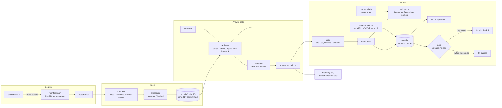

# evalgate

A RAG system over EU CBAM regulatory documents. The RAG part is deliberately
boring. What I actually built is the harness around it: an LLM judge whose
agreement with human labels is measured rather than assumed, a
${n_configs}-configuration retrieval sweep on a cost/latency/quality frontier,
and a CI gate that fails a pull request when quality drops.

The frozen baseline scores ${quality} composite quality at ${p95_ms} ms p95,
with a projected ${projected_cost} dollars per query. The judge agrees with my
labels at a Cohen's kappa of ${calibration_headline} across the three axes.
That spread is the interesting part, and I break it down below.

Most RAG projects I have read optimise the retriever and then guess at whether
it got better. This one is the other way round.

> Before you read the numbers: the ablation frontier ran on a synthetic corpus,
> with the rule-based judge and the extractive generator, because I built this
> in an environment that could reach neither the EU document servers nor an API
> key (D-0009 in the decision log). The calibration section is different - those
> scores came from a real LLM judge. So the two sets of numbers describe
> different configurations and you cannot read them together. The harness is
> real and the numbers are real measurements; what they measure is weaker than
> what this is designed to run on. Every substitution is a config flag with its
> cost written down. The README itself is rendered from the artifacts by
> `make readme`, so nothing in it was typed by hand.

## Architecture



Data flows one way. Nothing downstream writes upstream.

## Reproduce in 60 seconds

No network, no API key, no model download:

```bash
make dev          # uv sync, Python 3.12
make check        # ruff format + lint, mypy strict, pytest
make eval         # the quality gate against baseline.json -> exit 0
make gate-demo    # degrade the retriever, prove the gate blocks it, restore
```

`make gate-demo` is the one to watch. It drops `retriever.k` to 1, asserts the
gate fails, restores the baseline configuration, asserts it passes, and exits
nonzero if either expectation is wrong.

The rest of the pipeline, same conditions:

```bash
make ingest       # corpus -> chunks
make index        # LanceDB + bm25s, a no-op if nothing changed
make ablate       # sweep the config matrix, one immutable run each
make judge        # score the answer eval set
make report       # regenerate reports/ from the run artifacts
make label        # rate answers on three axes; resumable, loses nothing
make serve        # the query UI and POST /query on :8000
```

For the real system -- real documents, bge embeddings, API generator and judge:

```bash
make ml                              # sentence-transformers + torch
make corpus                          # fetch and pin the EU sources by SHA256
export ANTHROPIC_API_KEY=...
make eval PROFILE="+experiment=live"
```

## Serving it

`make serve` starts a FastAPI process and opens <http://localhost:8000> on a
query interface: ask a question, get the answer with every `[chunk#id]` marker
rendered as a button that scrolls to the passage it cites. Each citation is
labelled `verified` or `unsupported` by the same audit the evaluation uses, so
a fabricated citation is visible in the interface rather than only in a report.
The retrieval trace, token counts, latency split and the corpus, index, prompt
and config hashes are all on the page.

The API is unchanged and remains the contract: `GET /health` for readiness and
what the process is serving, `POST /query` for an answer with its trace. The UI
is a client of that endpoint and adds nothing to the answer path -- a serving
layer that reranked or rewrote queries on its own would be a different system
from the one the frontier below describes, and the frontier would quietly stop
being true.

Two environment variables gate a public deployment, both off by default because
the harness and the test suite want neither:

| variable | effect |
| --- | --- |
| `EVALGATE_API_KEY` | `POST /query` requires a matching `x-api-key` header |
| `EVALGATE_RATE_LIMIT_PER_MINUTE` | per-client fixed window; returns 429 with `retry-after` |
| `EVALGATE_OVERRIDES` | hydra overrides, space separated, e.g. `corpus=cbam` |

`/health` is exempt from both on purpose: a load balancer carries no key, and a
readiness probe that trips the rate limiter takes the service down exactly when
it is busiest. The limiter is a fixed window in process memory -- it resets on
restart and does not coordinate between replicas, so it stops a runaway script,
not a determined adversary. Anything stronger belongs in front of the app.

## The CI split: replay on every pull request, live once a night

This is the part I would want to talk about in a design review.

A harness that calls a model has an awkward property: the thing that makes it
worth having, running on every pull request, is also what makes it slow,
expensive and flaky. Run the full suite live on every push and you pay per
push, wait minutes, and eat failures that have nothing to do with the change
under review - a rate limit, a timeout, a model that came back one token less
deterministic than yesterday. So teams move it to a nightly job, and a gate
that runs after the merge is not a gate.

The split here is:

Every pull request replays. Model access goes through one client stack with
three modes, and `replay` is the default. A call gets served from a committed
cassette: one JSON file holding the request and response, reviewable in a diff.
An unmatched call is an error, never a network request. You get the full
evaluation - generation, judging, gate and all - in seconds, deterministically,
for nothing, and it cannot fail because of somebody else's quota. Change a
prompt, a model or a config and you get a cassette miss telling you to
re-record, rather than a surprise invoice.

One scheduled job runs live. `.github/workflows/nightly.yml` pulls the real
corpus, installs the local encoder, and runs the same suite against the real
API with its own frozen baseline. If the gate fails it opens an issue. Things
only a live model can show you - a provider-side update, changed refusal
behaviour, latency creep - surface there, once a day instead of once a push.

Neither half substitutes for the other. Replay catches "this change made
retrieval worse", which is most changes. Live catches "the world moved under
us", which is rarer and slower. Together they are what make it affordable to
gate every PR on quality at all.

`make record` re-records the cassettes. The recording is a reviewable diff, so
a change in what the model says is something a person looks at rather than a
number that quietly shifts.

*State of the cassettes in this repository:* empty. The environment this repo
was built in had no API credentials, so no live call was ever made and there
was nothing honest to record. The replay path is exercised by unit tests, and
the committed gate runs on the offline stack -- the extractive generator and the
rule-based judge -- which needs no cassettes at all. Recording them is one
command for anyone with a key.

## Judge calibration findings

Full report: [`reports/judge_calibration.md`](reports/judge_calibration.md).
Agreement between the configured judge (`${judge_model}`) and the only labels
currently on disk (`${label_source}`, ${label_pairs} paired items):

${calibration_table}

The judge and I agree on one axis out of three, and the axis we disagree on
worst is the one that matters most here.

Groundedness comes out at 0.800, with our means within 0.07 of each other.
That is substantial agreement by any conventional reading. On the question of
whether a claim is actually supported by the retrieved text, the judge and I
are measuring the same thing.

Relevance and citation correctness both sit near 0.35. That is fair agreement
at best. Quadratic kappa stays high on relevance (0.888) because our
disagreements there are near-misses, not reversals - but on citation
correctness it falls to 0.539, which means those gaps are real.

Then there is the direction of the error. The judge scores citation correctness
0.333 higher than I do, on average. It credits citations I rejected. For a
system whose whole claim is that its answers are checkable against the
regulation, that is the worst way round for the bias to run: a judge this
generous about citations would happily pass a generator that fabricates them.

I want to be careful about what I can conclude from that, though. One labeller
and ${answer_slots} items gives me no inter-annotator agreement, so a kappa of
0.35 is unattributable. It might mean the judge is wrong. It might mean the
axis is loose enough that two people would not agree either. Those want
different fixes - a better judge versus a sharper rubric - and this measurement
cannot tell me which. At n=${answer_slots} one item also moves kappa further
than any improvement I would plausibly make.

So the order of work is: a second labeller first, to find out what agreement
is even achievable before blaming the judge for missing it; then more items, so
a point of kappa means something; then tighter anchors in
`prompts/judge/rubric_v1.md` for whichever axis two humans agree on and the
judge still misses.

The bias probes, on the current judge: position swap moves no score at all
(the rule ignores context order by construction, which is what makes it a
useful control), length bias is weak in both directions across the three axes,
and the self-preference probe reports that it needs answers from two generators
and has not run.

## The ablation frontier

Full report with both frontier figures:
[`reports/pareto.md`](reports/pareto.md). ${n_configs} configurations measured
over {chunker} x {retriever} x {k}; the nine cross-encoder rerank cells need
the `ml` extra and are listed in the report as unmeasured. `*` marks a
configuration on at least one frontier.

${pareto_table}

What the sweep says on this corpus:

k matters more than anything else. Moving from k=3 to k=10 shifts recall
further than any choice of chunker or retriever, and it is also where the cost
goes - context tokens per query rise about fivefold across that range.

BM25 is the value pick. It lands within a few percent of hybrid RRF on quality
at roughly a tenth of the p95 latency. The fusion is paying for a dense arm
that the hashed embedder makes weak. Swap in real bge embeddings and that
balance should move, which makes it the first thing worth re-measuring.

Dense retrieval is the worst arm throughout, and you should not believe that.
It is a property of the deterministic hashed embedder, which is exactly what
that embedder is for: it makes the harness free to run and it makes this row
meaningless. Read it as a floor.

## The gate

`baseline.json` freezes the winning configuration: `${chunker}` chunking,
`${retriever}` retrieval at k=${k}, `${embedder}` embeddings, `${generator}`
generation, `${judge_model}` judging, over `${corpus}` (`${corpus_hash}`),
scored on ${n_retrieval_scored} retrieval slots and ${n_answers_scored} answer
slots. `make eval` re-measures and exits nonzero if composite quality drops
more than 2%, p95 latency rises more than 20%, or cost per query rises more
than 15%. Those thresholds live in `configs/gate/`; none of them appears in
Python.

Three behaviours in there are load-bearing.

Missing data fails. A metric absent from the run, absent from the baseline, or
a missing baseline file are all failures. The state where a regression is
invisible must never be the state where the build is green.

Changed ground fails. If the corpus, a prompt or an eval set differs from the
baseline's, the comparison means nothing, so the gate refuses instead of
printing a number. Changing them is fine - it needs a deliberate `make freeze`,
which shows up as a reviewable diff.

Changed configuration does not fail. The config hash and index hash are
supposed to differ. Judging that difference is the whole point.

## Engineering decisions and tradeoffs

Every non-obvious choice is in [`docs/DECISIONS.md`](docs/DECISIONS.md),
append-only, with its cost stated. The ones worth knowing before reading the
code:

- **Gold evidence is a verbatim span, not a chunk id** (D-0015). Chunk ids
  belong to a chunker and the ablation varies the chunker, so an id-keyed eval
  set could score exactly one configuration. Cost: a span straddling a chunk
  boundary is a miss, which is harsher than a human would be.
- **Everything is content-addressed.** Corpus, index, prompts, config,
  eval sets. A run that cannot state what it measured is not evidence, and the
  reporting layer refuses to put runs with different ground in one table.
- **Exact search, no ANN index** (D-0011). At this corpus size approximation
  buys nothing and costs reproducibility. It does not scale, and the entry says
  what to do when it stops being true.
- **Judge output is never parsed with a regex.** It arrives through a forced,
  strict tool call validated against a pydantic model built from the configured
  axes and scale (D-0020). On a schema violation the model is shown its own
  error and asked again; after the configured attempts it raises. Nothing ever
  defaults a score.
- **Serving cost and latency exclude judging** (D-0027). A user waits for
  retrieval and generation and does not pay for the judge. Judge spend is
  reported separately, because during development it is usually the larger
  bill.
- **Cost is reported twice** (D-0028), measured and projected, in separate
  columns. An offline generator's measured cost is genuinely zero while its
  token footprint still varies fivefold across configurations; reporting only
  the zero would hide a real difference and reporting the projection as
  measured would be a lie.
- **A rule-based judge and a no-model generator ship as baselines** (D-0021,
  D-0026). They answer "does the expensive thing beat the cheap thing", and
  they are what let the whole measurement path run with no credentials.

## Tooling we deliberately skipped

No DVC. No MLflow. Both would be ceremony at this size, and I am writing the
reasoning down because "we use DVC" is easier to put on a slide than "we
thought about it and decided not to".

Data versioning. What needs versioning here is the eval sets and the corpus
pin. The eval sets are small JSONL files (${retrieval_slots} retrieval slots,
${answer_slots} answer pairs) that live in git, diff as text in review, and are
exactly the kind of artifact where a reviewer wants to see the line-level
change. The corpus is large and not mine to redistribute, so what gets
versioned is `data/corpus/manifest.json`: one SHA256 per source document, which
pins the corpus exactly and reproduces it from public URLs. Putting a
content-addressed blob store in front of that buys me a remote to configure and
a cache to invalidate, in exchange for versioning bytes I deliberately do not
commit.

Experiment tracking. Every run writes one immutable parquet under
`runs/<timestamp>-<confighash>/`, keyed by a fingerprint of the config, next to
the prompt and corpus hashes it ran under. Reports are generated from those
files. The run history is queryable with pandas, diffable in git and portable
in a tarball, with no server to stand up, no schema migration, and no second
source of truth to reconcile when the tracking UI and the artifacts disagree. A
tracking server earns its keep when a lot of people run a lot of experiments
concurrently and need somewhere shared to look. That is not this repo, and if
it becomes this repo the artifacts are easy to import.

Both decisions are recorded with their tradeoffs in `docs/DECISIONS.md`.

## Limitations

Worst first.

1. The judge is only partly validated, and unattributably so. Groundedness
   agrees at 0.800. Relevance and citation correctness sit near 0.35, and with
   one labeller I cannot tell whether that is the judge being wrong or the
   rubric being loose. The citation bias runs generous, which is the dangerous
   direction. A second labeller is the next thing that would move this.
2. The corpus is synthetic. Five documents I wrote in the structural style of
   the CBAM instruments, marked as such in every file (D-0016). Shorter
   sentences, fewer cross-references, no 400-word provisions. The numbers here
   are optimistic against the real thing. `make corpus` does now fetch the real
   instruments - the regulation, the implementing regulation, both guidance
   documents, the ETS directive, with only the date-pinned consolidated text
   still 404ing - so switching is a matter of re-running under `corpus=cbam`,
   not of network access. I have not re-run it yet.
3. The measured generator makes no API call. The committed frontier uses the
   extractive baseline, so every quality figure is a floor and the cost axis is
   a projection rather than spend (D-0028). Relative ordering of retrieval
   configurations is what the sweep measures and does not depend on what sits
   downstream, but the absolute quality column would move with a real one.
4. The embeddings are a hash, not a model. `embedder=hashed` is a signed random
   projection (D-0005): deterministic, free, and much worse than bge-small. It
   is why dense retrieval is the worst arm, which tells you nothing about dense
   retrieval. Every dense and hybrid row wants re-running with
   `embedder=local`.
5. The eval sets are too small. ${retrieval_slots} retrieval slots and
   ${answer_slots} answer pairs, against targets of 120 and 150. At n=15 one
   item moves recall@k by 6.7 points, so anything smaller than that in the
   Pareto table is noise. `make gen-eval` drafts candidates and `make label`
   reviews them.
6. Replayed latency is recorded latency. A replay run reports the latency
   measured when the cassette was recorded, not the time to read it back
   (D-0030). That is the honest choice - the alternative reports disk speed as
   model latency - but p95 in a replayed run is a historical number, and the
   run record flags it.
7. The rerank arm is unmeasured. Nine of the 36 cells need the `ml` extra for
   the cross-encoder and got skipped with the reason recorded. Reranking is the
   one place in retrieval where a second model usually earns its cost, so this
   is the most interesting hole in the table.
8. One labeller, no inter-annotator agreement. The schema records who labelled
   what and when, so a second person is supported. With one, there is no way to
   separate judge error from label noise. See limitation 1 - these are the same
   problem.
9. The container image has never been built. The Dockerfile is written and
   reviewed, but I had no Docker daemon, so `make docker` has not run once.
   Treat it as unverified.

## Layout

    configs/          hydra config tree; paths, models, k values, thresholds
    prompts/          versioned prompt bodies, hashed into every run record
    src/evalgate/     the library
    scripts/          corpus acquisition, eval seeding, README rendering
    tests/            pytest suite, including retrieval property tests
    docs/DECISIONS.md append-only decision log
    runs/             immutable per-run parquet artifacts
    reports/          generated reports and figures
    baseline.json     the frozen measurement the gate compares against

`docs/PRINCIPLES.md` is the repo constitution: architecture, invariants, and the things
that must never be done.

## License

MIT.
