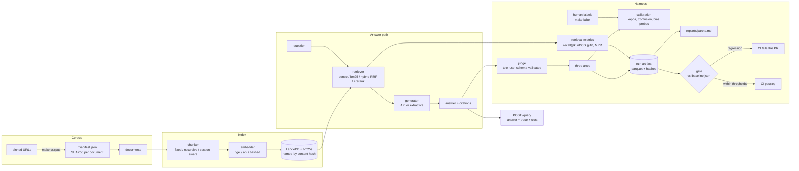

# evalgate

A retrieval-augmented question answering system over EU CBAM regulatory
documents whose actual product is the evaluation harness around it: an LLM
judge validated against human labels, a ${n_configs}-configuration retrieval
ablation on a cost/latency/quality frontier, and a CI gate that fails a pull
request when quality regresses. On the frozen baseline it scores **${quality}
composite quality** at **${p95_ms} ms p95** and a projected **$$${projected_cost}
per query**; the judge currently agrees with the available labels at a Cohen's
kappa of **${calibration_headline}**, which is bad, and the section below says
why and what would fix it.

The RAG application is deliberately ordinary. The measurement is the point.

> **Read this before the numbers.** Every figure here was produced against a
> **synthetic** corpus, with a **rule-based judge** and a **no-model generator**,
> because the environment this repository was built in could reach neither the
> EU document servers nor an API key (`docs/DECISIONS.md`, D-0009). The harness
> is real and the numbers are really measured; what they are measured on is
> weaker than the system this repo is designed to run. Every one of those
> substitutions is a config flag, and `docs/DECISIONS.md` records each with its
> cost. This README is generated from the artifacts by `make readme`, so no
> number in it was typed by hand.

## Architecture



Data flows one way. Nothing downstream writes upstream.

## Reproduce in 60 seconds

No network, no API key, no model download:

```bash
make dev          # uv sync, Python 3.12
make check        # ruff format + lint, mypy strict, pytest
make eval         # the quality gate against baseline.json -> exit 0
make gate-demo    # degrade the retriever, prove the gate blocks it, restore
```

`make gate-demo` is the one to watch. It drops `retriever.k` to 1, asserts the
gate fails, restores the baseline configuration, asserts it passes, and exits
nonzero if either expectation is wrong.

The rest of the pipeline, same conditions:

```bash
make ingest       # corpus -> chunks
make index        # LanceDB + bm25s, a no-op if nothing changed
make ablate       # sweep the config matrix, one immutable run each
make judge        # score the answer eval set
make report       # regenerate reports/ from the run artifacts
make label        # rate answers on three axes; resumable, loses nothing
make serve        # POST /query on :8000
```

For the real system -- real documents, bge embeddings, API generator and judge:

```bash
make ml                              # sentence-transformers + torch
make corpus                          # fetch and pin the EU sources by SHA256
export ANTHROPIC_API_KEY=...
make eval PROFILE="+experiment=live"
```

## The CI split: replay on every pull request, live once a night

This is the most interesting engineering decision in the project, so it gets
the most space.

An evaluation harness that calls a model has a problem: the thing that makes it
valuable -- running on every pull request -- is also what makes it expensive and
flaky. Running the full suite live on every push costs money per push, takes
minutes, and fails for reasons that have nothing to do with the change under
review: a rate limit, a timeout, a model that is one token less deterministic
than it was yesterday. Teams respond by running the suite nightly instead, and
a gate that runs after the merge is not a gate.

evalgate splits the difference:

**Every pull request replays.** All model access goes through one client stack
with three modes. In `replay` -- the default, and what CI runs -- a call is
served from a committed cassette: one JSON file per call, holding the request
and the response, reviewable in a diff. An unmatched call is an error, never a
network request. The result is a full evaluation, including generation, judging
and the quality gate, that is deterministic, takes seconds, costs nothing, and
cannot fail because of somebody else's rate limit. A change that alters a
prompt, a model or a config surfaces as a cassette miss with the command to
re-record, rather than as a surprise invoice.

**One scheduled job runs live.** `.github/workflows/nightly.yml` fetches the
real corpus, installs the local encoder, and runs the same suite against the
real API with its own frozen baseline (`baseline.live.json`). If the gate fails
it opens an issue. Drift that only a live model can show -- a provider-side
model update, a change in refusal behaviour, latency creep -- is found there, at
a cost of one run a day rather than one per push.

The two halves catch different things and neither substitutes for the other.
Replay catches "this change made retrieval worse", which is most changes. Live
catches "the world moved underneath us", which is rarer and slower-moving. The
split is what makes it affordable to gate every pull request on quality at all.

`make record` re-records the cassettes; the recording is a reviewable diff, so
a change in what the model says is something a human sees rather than something
that silently shifts a number.

*State of the cassettes in this repository:* empty. The environment this repo
was built in had no API credentials, so no live call was ever made and there
was nothing honest to record. The replay path is exercised by unit tests, and
the committed gate runs on the offline stack -- the extractive generator and the
rule-based judge -- which needs no cassettes at all. Recording them is one
command for anyone with a key.

## Judge calibration findings

Full report: [`reports/judge_calibration.md`](reports/judge_calibration.md).
Agreement between the configured judge (`${judge_model}`) and the only labels
currently on disk (`${label_source}`, ${label_pairs} paired items):

${calibration_table}

**These numbers are bad, and two separate things are wrong with them.**

*The judge is a rule.* `judge=heuristic` is a string-matching baseline that
ships specifically so the LLM judge has something to beat (`docs/DECISIONS.md`,
D-0021). It scores groundedness by content-word overlap with the retrieved
context, which cannot tell a supported claim from an unsupported one that
happens to reuse the vocabulary -- and the seed answers were written to contain
exactly that failure. A kappa near zero is the correct result for that rule on
that data, and it is the reason the LLM judge exists.

*The labels are not independent.* The same author wrote the answers and the
scores (D-0019), so agreement against them measures whether the judge
reconstructs the author's intent, not whether it agrees with a person. Nothing
built on them should be believed.

What would fix it, in order: label the ${answer_slots} answers through
`make label` to get independent labels; record cassettes with an API key so
`judge=sonnet` runs; regenerate. The pipeline that computes kappa, the
quadratic-weighted variant, the confusion matrices, the ten worst
disagreements and the three bias probes is complete and tested -- it is the
inputs that are placeholders, and the report says so on every table it prints.

The bias probes, on the current judge: position swap moves no score at all
(the rule ignores context order by construction, which is what makes it a
useful control), length bias is weak in both directions across the three axes,
and the self-preference probe reports that it needs answers from two generators
and has not run.

## The ablation frontier

Full report with both frontier figures:
[`reports/pareto.md`](reports/pareto.md). ${n_configs} configurations measured
over {chunker} x {retriever} x {k}; the nine cross-encoder rerank cells need
the `ml` extra and are listed in the report as unmeasured. `*` marks a
configuration on at least one frontier.

${pareto_table}

Three things the sweep says, on this corpus:

- **k dominates everything else.** Going from k=3 to k=10 moves recall more
  than any choice of chunker or retriever, and it is also what moves cost:
  context tokens per query rise about fivefold across that range.
- **BM25 is the value pick.** It lands within a few percent of hybrid RRF on
  quality at roughly a tenth of the p95 latency, because the fusion pays for a
  dense arm that the hashed embedder makes weak. With real bge embeddings that
  balance should move, which is exactly the measurement to re-run first.
- **Dense retrieval is the worst arm throughout.** That is a property of the
  deterministic hashed embedder, not of dense retrieval, and it is what that
  embedder is for: it makes the harness free to run and it makes this row of
  the table meaningless. Read it as a floor.

## The gate

`baseline.json` freezes the winning configuration: `${chunker}` chunking,
`${retriever}` retrieval at k=${k}, `${embedder}` embeddings, `${generator}`
generation, `${judge_model}` judging, over `${corpus}` (`${corpus_hash}`),
scored on ${n_retrieval_scored} retrieval slots and ${n_answers_scored} answer
slots. `make eval` re-measures and exits nonzero if composite quality drops
more than 2%, p95 latency rises more than 20%, or cost per query rises more
than 15%. Those thresholds live in `configs/gate/`; none of them appears in
Python.

Three behaviours are load-bearing:

- **Missing data fails.** A metric absent from the run, absent from the
  baseline, or a missing baseline file are all failures. The state in which a
  regression is invisible must not be the state in which the build is green.
- **Changed ground fails.** If the corpus, a prompt or an eval set differs from
  the baseline's, the comparison is meaningless and the gate refuses rather
  than producing a number. Changing them is fine; it needs a deliberate
  `make freeze`, which is a reviewable diff.
- **Changed configuration does not fail.** The config hash and index hash are
  expected to differ -- judging that difference is the entire point.

## Engineering decisions and tradeoffs

Every non-obvious choice is in [`docs/DECISIONS.md`](docs/DECISIONS.md),
append-only, with its cost stated. The ones worth knowing before reading the
code:

- **Gold evidence is a verbatim span, not a chunk id** (D-0015). Chunk ids
  belong to a chunker and the ablation varies the chunker, so an id-keyed eval
  set could score exactly one configuration. Cost: a span straddling a chunk
  boundary is a miss, which is harsher than a human would be.
- **Everything is content-addressed.** Corpus, index, prompts, config,
  eval sets. A run that cannot state what it measured is not evidence, and the
  reporting layer refuses to put runs with different ground in one table.
- **Exact search, no ANN index** (D-0011). At this corpus size approximation
  buys nothing and costs reproducibility. It does not scale, and the entry says
  what to do when it stops being true.
- **Judge output is never parsed with a regex.** It arrives through a forced,
  strict tool call validated against a pydantic model built from the configured
  axes and scale (D-0020). On a schema violation the model is shown its own
  error and asked again; after the configured attempts it raises. Nothing ever
  defaults a score.
- **Serving cost and latency exclude judging** (D-0027). A user waits for
  retrieval and generation and does not pay for the judge. Judge spend is
  reported separately, because during development it is usually the larger
  bill.
- **Cost is reported twice** (D-0028), measured and projected, in separate
  columns. An offline generator's measured cost is genuinely zero while its
  token footprint still varies fivefold across configurations; reporting only
  the zero would hide a real difference and reporting the projection as
  measured would be a lie.
- **A rule-based judge and a no-model generator ship as baselines** (D-0021,
  D-0026). They answer "does the expensive thing beat the cheap thing", and
  they are what let the whole measurement path run with no credentials.

## Tooling we deliberately skipped

No DVC. No MLflow. Both would be ceremony here, and the reason is worth stating
because "we use DVC" is easier to put on a slide than "we thought about it".

**Data versioning (DVC).** The things that need versioning are the eval sets
and the corpus pin. The eval sets are small JSONL files -- ${retrieval_slots}
retrieval slots, ${answer_slots} answer pairs -- that live in git, diff as text
in review, and are the sort of artifact where a reviewer genuinely wants to see
the line-level change. The corpus is large and not ours to redistribute, so
what is versioned is `data/corpus/manifest.json`: one SHA256 per source
document, which pins the corpus exactly and reproduces it from public URLs. A
content-addressed blob store in front of that would add a remote to configure
and a cache to invalidate, in exchange for versioning bytes we deliberately do
not commit.

**Experiment tracking (MLflow).** Every run writes one immutable parquet under
`runs/<timestamp>-<confighash>/`, keyed by a fingerprint of the config that
produced it, alongside the prompt hashes and corpus hash it ran under. Reports
are generated from those files. That makes the run history queryable with
pandas, diffable in git, and portable in a tarball, with no server to stand up,
no schema migration, and no second source of truth to reconcile when the
tracking server and the artifacts disagree. A tracking server earns its keep
when many people run many experiments concurrently and need a shared UI. That
is not this repo.

Both decisions are recorded with their tradeoffs in `docs/DECISIONS.md`.

## Limitations

Stated plainly, worst first.

1. **The judge is not validated.** Kappa against the only labels on disk is
   near zero on two of three axes, and those labels are not independent anyway.
   Nothing in this repository currently demonstrates that an LLM judge agrees
   with a person about CBAM answers. What it demonstrates is a pipeline that
   would measure exactly that, plus a rule-based baseline that fails it in the
   way a string-matching rule should. Fixing it needs human labelling and an
   API key, in that order.
2. **The corpus is synthetic.** Five documents written for this repository in
   the structural style of the CBAM instruments, marked as such in every file
   (D-0016). It is smaller, shallower and more regular than the real
   regulation: shorter sentences, fewer cross-references, no 400-word
   provisions. Absolute numbers here are optimistic against the real corpus.
   `corpus=cbam` switches over once `make corpus` can reach EUR-Lex.
3. **The measured generator makes no API call.** The committed frontier uses
   the extractive baseline, so every quality figure is a floor, and the cost
   axis is a projection rather than spend (D-0028). The relative ordering of
   retrieval configurations is what the sweep measures and does not depend on
   what sits downstream, but the absolute quality column would move with a real
   generator.
4. **The embeddings are a hash, not a model.** `embedder=hashed` is a signed
   random projection (D-0005): deterministic, free, and much worse than
   bge-small. It makes dense retrieval the worst arm in the sweep, which says
   nothing about dense retrieval. Every dense and hybrid row should be re-run
   with `embedder=local`.
5. **The eval sets are small.** ${retrieval_slots} retrieval slots and
   ${answer_slots} answer pairs against targets of 120 and 150. With n=15 a
   single item moves recall@k by 6.7 points, so differences smaller than that
   in the Pareto table are noise. `make gen-eval` drafts candidates and
   `make label` reviews them; both are implemented and neither has been run
   against a model.
6. **Replayed latency is recorded latency.** A run in replay mode reports the
   latency measured when the cassette was recorded, not the time to read it
   back (D-0030). That is the honest choice -- the alternative reports disk
   speed as model latency -- but it means p95 in a replayed run is a historical
   measurement, and the run record marks it as replayed.
7. **The rerank arm is unmeasured.** Nine of the 36 sweep cells need the `ml`
   extra for the cross-encoder and were skipped with the reason recorded. Since
   reranking is the one place in retrieval where a second model usually earns
   its cost, that is the most interesting missing row in the table.
8. **One labeller, no inter-annotator agreement.** The schema records who
   labelled what and when, so a second labeller is supported, but with one
   person there is no way to know how much of the judge-human gap is judge
   error and how much is label noise.
9. **The container image has never been built.** The `Dockerfile` is written
   and reviewed but the environment this repo was built in has no Docker
   daemon, so `make docker` has not run once. Treat it as unverified until it
   has.

## Layout

    configs/          hydra config tree; paths, models, k values, thresholds
    prompts/          versioned prompt bodies, hashed into every run record
    src/evalgate/     the library
    scripts/          corpus acquisition, eval seeding, README rendering
    tests/            pytest suite, including retrieval property tests
    docs/DECISIONS.md append-only decision log
    runs/             immutable per-run parquet artifacts
    reports/          generated reports and figures
    baseline.json     the frozen measurement the gate compares against

`CLAUDE.md` is the repo constitution: architecture, invariants, and the things
that must never be done.

## License

MIT.
