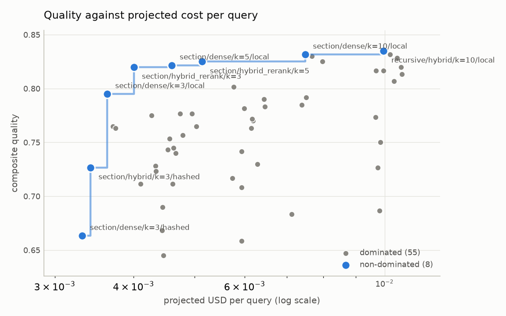
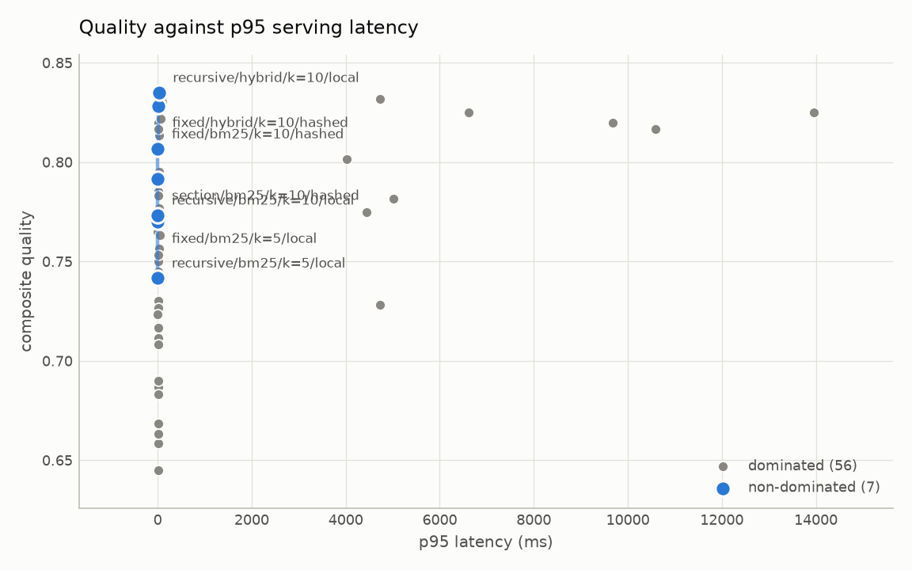

# Retrieval ablations and the cost/latency/quality frontier

- configurations measured: 63
- corpus: cbam_synthetic (83d3414da810)
- generator: extractive / extractive-v1
- judge: heuristic / rule-based-v1
- embedder: hashed / hashed-ngram-projection-v1
- api mode: replay
- quality: composite of the judge axes and recall@k, weighted by `configs/gate/`

## Results

`*` marks a configuration on at least one frontier (14 of 63).

|  | config | quality | recall@k | nDCG@10 | MRR | grounded | relevant | citations | p50 ms | p95 ms | ctx tok | measured $/q | projected $/q |
| --- | --- | --- | --- | --- | --- | --- | --- | --- | --- | --- | --- | --- | --- |
| * | recursive/hybrid/k=10/local | 0.835 | 0.867 | 0.548 | 0.453 | 4.00 | 3.73 | 5.00 | 18.2 | 23.1 | 2572 | 0.000000 | 0.009963 |
|  | fixed/hybrid_rerank/k=10 | 0.832 | 0.933 | 0.570 | 0.457 | 4.00 | 3.40 | 5.00 | 4448.6 | 4731.7 | 2781 | 0.000000 | 0.010201 |
| * | section/dense/k=10/local | 0.832 | 0.933 | 0.692 | 0.611 | 3.87 | 3.60 | 5.00 | 20.8 | 24.0 | 1826 | 0.000000 | 0.007482 |
|  | section/hybrid/k=10/local | 0.830 | 0.933 | 0.635 | 0.544 | 3.80 | 3.67 | 5.00 | 22.7 | 104.9 | 1894 | 0.000000 | 0.007672 |
| * | fixed/hybrid/k=10/hashed | 0.828 | 0.867 | 0.437 | 0.310 | 3.87 | 3.80 | 5.00 | 7.9 | 11.4 | 2793 | 0.000000 | 0.010471 |
| * | section/hybrid_rerank/k=5 | 0.825 | 0.933 | 0.735 | 0.667 | 3.87 | 3.47 | 5.00 | 5497.3 | 6617.6 | 956 | 0.000000 | 0.005137 |
|  | section/hybrid_rerank/k=10 | 0.825 | 0.933 | 0.735 | 0.667 | 3.87 | 3.47 | 5.00 | 6768.5 | 13964.4 | 1899 | 0.000000 | 0.007965 |
| * | section/dense/k=5/local | 0.822 | 0.933 | 0.692 | 0.611 | 3.73 | 3.60 | 5.00 | 34.1 | 62.0 | 866 | 0.000000 | 0.004601 |
|  | fixed/dense/k=10/local | 0.820 | 0.800 | 0.611 | 0.553 | 4.07 | 3.60 | 5.00 | 16.6 | 21.1 | 2787 | 0.000000 | 0.010624 |
| * | section/hybrid_rerank/k=3 | 0.820 | 0.933 | 0.735 | 0.667 | 3.80 | 3.47 | 5.00 | 6031.1 | 9672.2 | 579 | 0.000000 | 0.004007 |
|  | recursive/dense/k=10/local | 0.817 | 0.867 | 0.596 | 0.515 | 3.93 | 3.47 | 5.00 | 17.0 | 19.3 | 2581 | 0.000000 | 0.009960 |
|  | recursive/hybrid_rerank/k=10 | 0.817 | 0.867 | 0.568 | 0.467 | 3.93 | 3.47 | 5.00 | 4005.8 | 10583.8 | 2593 | 0.000000 | 0.009687 |
|  | fixed/hybrid/k=10/local | 0.813 | 0.733 | 0.566 | 0.513 | 4.07 | 3.73 | 5.00 | 20.3 | 24.0 | 2809 | 0.000000 | 0.010647 |
| * | fixed/bm25/k=10/hashed | 0.807 | 0.733 | 0.483 | 0.405 | 3.93 | 3.80 | 5.00 | 0.6 | 0.8 | 2786 | 0.000000 | 0.010347 |
|  | fixed/bm25/k=10/local | 0.807 | 0.733 | 0.483 | 0.405 | 3.93 | 3.80 | 5.00 | 0.3 | 1.3 | 2786 | 0.000000 | 0.010347 |
|  | recursive/hybrid_rerank/k=5 | 0.802 | 0.867 | 0.568 | 0.467 | 3.73 | 3.47 | 5.00 | 3766.6 | 4019.6 | 1285 | 0.000000 | 0.005765 |
| * | section/dense/k=3/local | 0.795 | 0.800 | 0.635 | 0.578 | 3.73 | 3.60 | 5.00 | 19.5 | 26.0 | 544 | 0.000000 | 0.003636 |
| * | section/bm25/k=10/hashed | 0.792 | 0.733 | 0.578 | 0.531 | 3.73 | 3.80 | 5.00 | 0.5 | 0.8 | 1852 | 0.000000 | 0.007510 |
|  | section/bm25/k=10/local | 0.792 | 0.733 | 0.578 | 0.531 | 3.73 | 3.80 | 5.00 | 0.4 | 1.5 | 1852 | 0.000000 | 0.007510 |
|  | fixed/hybrid/k=5/local | 0.790 | 0.667 | 0.546 | 0.506 | 3.93 | 3.73 | 5.00 | 18.4 | 21.9 | 1407 | 0.000000 | 0.006440 |
|  | section/hybrid/k=10/hashed | 0.785 | 0.733 | 0.559 | 0.509 | 3.73 | 3.67 | 5.00 | 7.8 | 10.6 | 1895 | 0.000000 | 0.007396 |
|  | fixed/dense/k=5/local | 0.783 | 0.667 | 0.566 | 0.533 | 3.93 | 3.60 | 5.00 | 16.8 | 19.8 | 1399 | 0.000000 | 0.006460 |
|  | fixed/hybrid_rerank/k=5 | 0.782 | 0.733 | 0.505 | 0.430 | 3.87 | 3.40 | 5.00 | 4051.1 | 5014.8 | 1378 | 0.000000 | 0.005992 |
|  | fixed/hybrid/k=3/local | 0.777 | 0.600 | 0.517 | 0.489 | 3.93 | 3.73 | 5.00 | 16.3 | 18.9 | 841 | 0.000000 | 0.004742 |
|  | section/hybrid/k=5/local | 0.777 | 0.667 | 0.546 | 0.506 | 3.80 | 3.67 | 5.00 | 19.1 | 25.7 | 987 | 0.000000 | 0.004951 |
|  | recursive/hybrid_rerank/k=3 | 0.775 | 0.733 | 0.510 | 0.433 | 3.73 | 3.47 | 5.00 | 3790.9 | 4441.0 | 788 | 0.000000 | 0.004274 |
|  | recursive/bm25/k=10/hashed | 0.773 | 0.733 | 0.506 | 0.436 | 3.80 | 3.73 | 4.73 | 0.6 | 0.8 | 2557 | 0.000000 | 0.009682 |
| * | recursive/bm25/k=10/local | 0.773 | 0.733 | 0.506 | 0.436 | 3.80 | 3.73 | 4.73 | 0.3 | 0.4 | 2557 | 0.000000 | 0.009682 |
|  | recursive/dense/k=5/local | 0.772 | 0.667 | 0.537 | 0.494 | 3.87 | 3.47 | 5.00 | 16.5 | 18.3 | 1317 | 0.000000 | 0.006168 |
|  | fixed/bm25/k=5/hashed | 0.770 | 0.600 | 0.442 | 0.389 | 3.80 | 3.80 | 5.00 | 0.5 | 0.7 | 1398 | 0.000000 | 0.006183 |
| * | fixed/bm25/k=5/local | 0.770 | 0.600 | 0.442 | 0.389 | 3.80 | 3.80 | 5.00 | 0.3 | 0.4 | 1398 | 0.000000 | 0.006183 |
|  | section/bm25/k=5/hashed | 0.765 | 0.600 | 0.533 | 0.511 | 3.73 | 3.80 | 5.00 | 0.4 | 0.7 | 1025 | 0.000000 | 0.005030 |
|  | section/bm25/k=3/hashed | 0.765 | 0.600 | 0.533 | 0.511 | 3.73 | 3.80 | 5.00 | 0.4 | 0.7 | 586 | 0.000000 | 0.003712 |
|  | section/bm25/k=3/local | 0.765 | 0.600 | 0.533 | 0.511 | 3.73 | 3.80 | 5.00 | 0.3 | 0.7 | 586 | 0.000000 | 0.003712 |
|  | section/bm25/k=5/local | 0.765 | 0.600 | 0.533 | 0.511 | 3.73 | 3.80 | 5.00 | 0.5 | 1.0 | 1025 | 0.000000 | 0.005030 |
|  | recursive/hybrid/k=5/local | 0.763 | 0.533 | 0.437 | 0.406 | 3.93 | 3.73 | 5.00 | 16.9 | 19.9 | 1299 | 0.000000 | 0.006144 |
|  | section/hybrid/k=3/local | 0.763 | 0.600 | 0.517 | 0.489 | 3.80 | 3.67 | 5.00 | 28.6 | 42.5 | 585 | 0.000000 | 0.003747 |
|  | fixed/dense/k=3/local | 0.757 | 0.533 | 0.509 | 0.500 | 3.93 | 3.60 | 5.00 | 16.9 | 26.8 | 841 | 0.000000 | 0.004786 |
|  | recursive/dense/k=3/local | 0.753 | 0.600 | 0.509 | 0.478 | 3.80 | 3.47 | 5.00 | 15.9 | 17.7 | 782 | 0.000000 | 0.004563 |
|  | recursive/hybrid/k=10/hashed | 0.750 | 0.667 | 0.466 | 0.407 | 3.80 | 3.53 | 4.73 | 8.3 | 11.2 | 2566 | 0.000000 | 0.009844 |
|  | recursive/hybrid/k=3/local | 0.745 | 0.467 | 0.409 | 0.389 | 3.87 | 3.73 | 5.00 | 16.8 | 19.0 | 795 | 0.000000 | 0.004631 |
|  | fixed/bm25/k=3/hashed | 0.743 | 0.467 | 0.384 | 0.356 | 3.80 | 3.80 | 5.00 | 0.6 | 1.1 | 849 | 0.000000 | 0.004534 |
|  | fixed/bm25/k=3/local | 0.743 | 0.467 | 0.384 | 0.356 | 3.80 | 3.80 | 5.00 | 0.3 | 0.4 | 849 | 0.000000 | 0.004534 |
|  | recursive/bm25/k=5/hashed | 0.742 | 0.600 | 0.463 | 0.419 | 3.73 | 3.73 | 4.73 | 0.5 | 0.7 | 1309 | 0.000000 | 0.005938 |
| * | recursive/bm25/k=5/local | 0.742 | 0.600 | 0.463 | 0.419 | 3.73 | 3.73 | 4.73 | 0.3 | 0.4 | 1309 | 0.000000 | 0.005938 |
|  | section/hybrid/k=5/hashed | 0.740 | 0.533 | 0.492 | 0.480 | 3.67 | 3.67 | 5.00 | 8.6 | 10.7 | 984 | 0.000000 | 0.004663 |
|  | fixed/hybrid/k=5/hashed | 0.730 | 0.400 | 0.288 | 0.250 | 3.80 | 3.80 | 5.00 | 8.0 | 11.0 | 1399 | 0.000000 | 0.006290 |
|  | fixed/hybrid_rerank/k=3 | 0.728 | 0.467 | 0.393 | 0.367 | 3.87 | 3.40 | 5.00 | 3719.2 | 4720.8 | 826 | 0.000000 | 0.004337 |
|  | fixed/dense/k=10/hashed | 0.727 | 0.533 | 0.356 | 0.297 | 4.07 | 3.20 | 4.73 | 6.5 | 7.8 | 2698 | 0.000000 | 0.009760 |
| * | section/hybrid/k=3/hashed | 0.727 | 0.467 | 0.467 | 0.467 | 3.67 | 3.67 | 5.00 | 8.4 | 18.2 | 570 | 0.000000 | 0.003421 |
|  | recursive/bm25/k=3/hashed | 0.723 | 0.467 | 0.409 | 0.389 | 3.67 | 4.00 | 4.73 | 0.5 | 0.7 | 777 | 0.000000 | 0.004340 |
|  | recursive/bm25/k=3/local | 0.723 | 0.467 | 0.409 | 0.389 | 3.67 | 4.00 | 4.73 | 0.3 | 0.4 | 777 | 0.000000 | 0.004340 |
|  | fixed/dense/k=5/hashed | 0.717 | 0.467 | 0.335 | 0.289 | 3.93 | 3.47 | 4.73 | 6.5 | 8.4 | 1359 | 0.000000 | 0.005742 |
|  | fixed/dense/k=3/hashed | 0.712 | 0.467 | 0.335 | 0.289 | 3.87 | 3.47 | 4.73 | 7.0 | 8.2 | 813 | 0.000000 | 0.004104 |
|  | fixed/hybrid/k=3/hashed | 0.712 | 0.333 | 0.260 | 0.233 | 3.73 | 3.80 | 5.00 | 7.9 | 10.7 | 841 | 0.000000 | 0.004616 |
|  | recursive/hybrid/k=5/hashed | 0.708 | 0.467 | 0.401 | 0.380 | 3.60 | 3.80 | 4.73 | 7.0 | 9.6 | 1262 | 0.000000 | 0.005932 |
|  | recursive/hybrid/k=3/hashed | 0.690 | 0.400 | 0.375 | 0.367 | 3.53 | 3.80 | 4.73 | 7.7 | 11.6 | 767 | 0.000000 | 0.004447 |
|  | recursive/dense/k=10/hashed | 0.687 | 0.467 | 0.349 | 0.313 | 3.53 | 3.87 | 4.47 | 6.6 | 8.3 | 2539 | 0.000000 | 0.009822 |
|  | section/dense/k=10/hashed | 0.683 | 0.467 | 0.409 | 0.389 | 3.53 | 3.80 | 4.47 | 7.5 | 9.5 | 1839 | 0.000000 | 0.007120 |
|  | section/dense/k=5/hashed | 0.668 | 0.467 | 0.409 | 0.389 | 3.33 | 3.80 | 4.47 | 8.0 | 9.5 | 946 | 0.000000 | 0.004441 |
| * | section/dense/k=3/hashed | 0.663 | 0.467 | 0.409 | 0.389 | 3.27 | 3.80 | 4.47 | 7.8 | 9.2 | 571 | 0.000000 | 0.003316 |
|  | recursive/dense/k=5/hashed | 0.658 | 0.400 | 0.329 | 0.306 | 3.33 | 3.87 | 4.47 | 7.0 | 8.0 | 1243 | 0.000000 | 0.005934 |
|  | recursive/dense/k=3/hashed | 0.645 | 0.333 | 0.300 | 0.289 | 3.33 | 3.87 | 4.47 | 6.9 | 7.8 | 753 | 0.000000 | 0.004463 |

## Frontiers

Measured cost is zero for every run above because the generator makes no API call, so the cost frontier is plotted on projected cost: this run's context and answer tokens priced at the configured model's rates. It is a projection, not a measurement, and it is labelled as one wherever it appears.

<picture>
  <source media="(prefers-color-scheme: dark)" srcset="figures/pareto_quality_cost_dark.png">
  
</picture>

<picture>
  <source media="(prefers-color-scheme: dark)" srcset="figures/pareto_quality_latency_dark.png">
  
</picture>

### Non-dominated configurations

| frontier | config | quality | projected $/q | p95 ms |
| --- | --- | --- | --- | --- |
| cost | recursive/hybrid/k=10/local | 0.835 | 0.009963 | 23.1 |
| cost | section/dense/k=10/local | 0.832 | 0.007482 | 24.0 |
| cost | section/hybrid_rerank/k=5 | 0.825 | 0.005137 | 6617.6 |
| cost | section/dense/k=5/local | 0.822 | 0.004601 | 62.0 |
| cost | section/hybrid_rerank/k=3 | 0.820 | 0.004007 | 9672.2 |
| cost | section/dense/k=3/local | 0.795 | 0.003636 | 26.0 |
| cost | section/hybrid/k=3/hashed | 0.727 | 0.003421 | 18.2 |
| cost | section/dense/k=3/hashed | 0.663 | 0.003316 | 9.2 |
| latency | recursive/hybrid/k=10/local | 0.835 | 0.009963 | 23.1 |
| latency | fixed/hybrid/k=10/hashed | 0.828 | 0.010471 | 11.4 |
| latency | fixed/bm25/k=10/hashed | 0.807 | 0.010347 | 0.8 |
| latency | section/bm25/k=10/hashed | 0.792 | 0.007510 | 0.8 |
| latency | recursive/bm25/k=10/local | 0.773 | 0.009682 | 0.4 |
| latency | fixed/bm25/k=5/local | 0.770 | 0.006183 | 0.4 |
| latency | recursive/bm25/k=5/local | 0.742 | 0.005938 | 0.4 |
