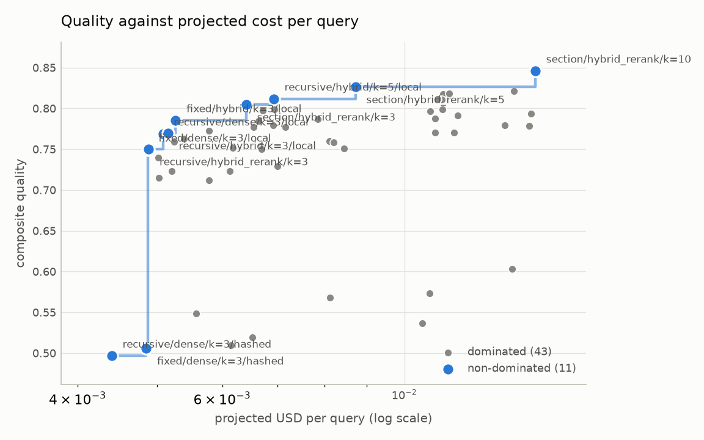
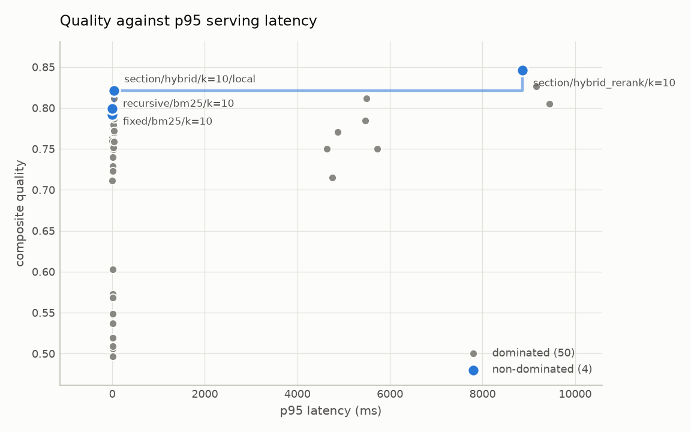

# Retrieval ablations and the cost/latency/quality frontier

- configurations measured: 54
- corpus: cbam (ab0fc00c7468)
- judge: heuristic / rule-based-v1
- generator: extractive / extractive-v1
- embedder: hashed / hashed-ngram-projection-v1, local / BAAI/bge-small-en-v1.5
- api mode: replay
- quality: composite of the judge axes and recall@k, weighted by `configs/gate/`

## Results

`*` marks a configuration on at least one frontier (14 of 54).

|  | config | quality | recall@k | nDCG@10 | MRR | grounded | relevant | citations | p50 ms | p95 ms | ctx tok | measured $/q | projected $/q |
| --- | --- | --- | --- | --- | --- | --- | --- | --- | --- | --- | --- | --- | --- |
| * | section/hybrid_rerank/k=10 | 0.846 | 0.929 | 0.805 | 0.765 | 4.25 | 3.33 | 5.00 | 8610.4 | 8861.2 | 3726 | 0.000000 | 0.014434 |
| * | section/hybrid_rerank/k=5 | 0.826 | 0.893 | 0.792 | 0.759 | 4.08 | 3.33 | 5.00 | 8909.8 | 9163.5 | 1821 | 0.000000 | 0.008718 |
| * | section/hybrid/k=10/local | 0.821 | 0.857 | 0.647 | 0.583 | 4.17 | 3.25 | 5.00 | 26.4 | 31.1 | 3625 | 0.000000 | 0.013603 |
|  | recursive/hybrid/k=10/local | 0.818 | 0.893 | 0.713 | 0.654 | 4.08 | 3.17 | 5.00 | 27.4 | 32.0 | 2950 | 0.000000 | 0.011347 |
|  | fixed/hybrid/k=10/local | 0.818 | 0.786 | 0.644 | 0.596 | 4.25 | 3.33 | 5.00 | 27.0 | 34.4 | 2803 | 0.000000 | 0.011154 |
| * | recursive/hybrid/k=5/local | 0.812 | 0.893 | 0.713 | 0.654 | 4.00 | 3.17 | 5.00 | 27.5 | 32.3 | 1479 | 0.000000 | 0.006932 |
|  | recursive/hybrid_rerank/k=10 | 0.812 | 0.893 | 0.693 | 0.631 | 4.00 | 3.17 | 5.00 | 4786.3 | 5494.5 | 2892 | 0.000000 | 0.010967 |
|  | recursive/dense/k=10/local | 0.811 | 0.857 | 0.707 | 0.659 | 4.08 | 3.17 | 5.00 | 26.0 | 32.5 | 2909 | 0.000000 | 0.011108 |
| * | section/hybrid_rerank/k=3 | 0.805 | 0.786 | 0.746 | 0.732 | 4.08 | 3.33 | 5.00 | 9020.8 | 9446.0 | 1054 | 0.000000 | 0.006418 |
| * | fixed/bm25/k=10 | 0.799 | 0.714 | 0.526 | 0.464 | 4.08 | 3.50 | 5.00 | 0.1 | 0.4 | 2804 | 0.000000 | 0.011132 |
|  | fixed/hybrid/k=5/local | 0.799 | 0.786 | 0.644 | 0.596 | 4.00 | 3.33 | 5.00 | 27.8 | 33.7 | 1400 | 0.000000 | 0.006945 |
|  | recursive/dense/k=5/local | 0.798 | 0.821 | 0.694 | 0.653 | 4.00 | 3.17 | 5.00 | 25.7 | 30.8 | 1446 | 0.000000 | 0.006719 |
|  | fixed/dense/k=10/local | 0.797 | 0.786 | 0.603 | 0.543 | 4.08 | 3.17 | 5.00 | 26.3 | 30.9 | 2802 | 0.000000 | 0.010752 |
|  | section/bm25/k=10 | 0.794 | 0.750 | 0.515 | 0.441 | 4.08 | 3.25 | 5.00 | 0.1 | 0.5 | 3911 | 0.000000 | 0.014276 |
| * | recursive/bm25/k=10 | 0.792 | 0.750 | 0.582 | 0.528 | 4.00 | 3.33 | 5.00 | 0.1 | 0.4 | 2972 | 0.000000 | 0.011622 |
|  | fixed/hybrid/k=10/hashed | 0.788 | 0.679 | 0.425 | 0.344 | 4.25 | 3.17 | 5.00 | 8.0 | 8.8 | 2804 | 0.000000 | 0.010897 |
|  | section/hybrid/k=5/local | 0.787 | 0.714 | 0.601 | 0.564 | 4.08 | 3.25 | 5.00 | 27.0 | 32.5 | 1706 | 0.000000 | 0.007848 |
| * | fixed/hybrid/k=3/local | 0.785 | 0.750 | 0.631 | 0.589 | 3.92 | 3.33 | 5.00 | 27.3 | 33.2 | 841 | 0.000000 | 0.005266 |
|  | recursive/hybrid_rerank/k=5 | 0.784 | 0.786 | 0.660 | 0.618 | 3.92 | 3.17 | 5.00 | 4676.7 | 5469.6 | 1451 | 0.000000 | 0.006644 |
|  | fixed/bm25/k=5 | 0.779 | 0.679 | 0.514 | 0.458 | 3.92 | 3.50 | 5.00 | 0.1 | 0.4 | 1400 | 0.000000 | 0.006922 |
|  | section/dense/k=10/local | 0.779 | 0.750 | 0.656 | 0.626 | 4.00 | 3.08 | 5.00 | 24.5 | 29.3 | 3301 | 0.000000 | 0.013255 |
|  | section/hybrid/k=10/hashed | 0.779 | 0.643 | 0.413 | 0.341 | 4.17 | 3.25 | 5.00 | 7.6 | 8.5 | 3842 | 0.000000 | 0.014187 |
|  | recursive/bm25/k=5 | 0.777 | 0.679 | 0.556 | 0.516 | 4.00 | 3.33 | 5.00 | 0.1 | 0.5 | 1487 | 0.000000 | 0.007167 |
|  | fixed/dense/k=5/local | 0.777 | 0.750 | 0.590 | 0.537 | 3.92 | 3.17 | 5.00 | 25.9 | 31.4 | 1401 | 0.000000 | 0.006549 |
|  | section/hybrid/k=3/local | 0.772 | 0.643 | 0.572 | 0.548 | 4.08 | 3.25 | 5.00 | 27.7 | 31.6 | 1017 | 0.000000 | 0.005781 |
|  | fixed/hybrid_rerank/k=10 | 0.771 | 0.821 | 0.583 | 0.506 | 3.75 | 3.50 | 4.67 | 4251.5 | 4876.7 | 2805 | 0.000000 | 0.010908 |
|  | recursive/hybrid/k=10/hashed | 0.770 | 0.643 | 0.414 | 0.341 | 4.17 | 3.08 | 5.00 | 8.3 | 9.0 | 2972 | 0.000000 | 0.011500 |
| * | recursive/hybrid/k=3/local | 0.770 | 0.714 | 0.639 | 0.613 | 3.92 | 3.17 | 5.00 | 26.5 | 31.0 | 886 | 0.000000 | 0.005153 |
| * | recursive/dense/k=3/local | 0.769 | 0.679 | 0.634 | 0.619 | 4.00 | 3.17 | 5.00 | 25.6 | 29.7 | 900 | 0.000000 | 0.005081 |
|  | recursive/bm25/k=3 | 0.763 | 0.607 | 0.527 | 0.500 | 4.00 | 3.33 | 5.00 | 0.1 | 0.4 | 895 | 0.000000 | 0.005394 |
|  | section/bm25/k=5 | 0.760 | 0.643 | 0.478 | 0.424 | 3.92 | 3.25 | 5.00 | 0.1 | 0.6 | 1854 | 0.000000 | 0.008103 |
|  | fixed/bm25/k=3 | 0.759 | 0.607 | 0.483 | 0.440 | 3.83 | 3.50 | 5.00 | 0.1 | 0.4 | 840 | 0.000000 | 0.005241 |
|  | section/dense/k=5/local | 0.759 | 0.679 | 0.632 | 0.616 | 3.92 | 3.08 | 5.00 | 27.1 | 33.3 | 1616 | 0.000000 | 0.008201 |
|  | fixed/hybrid/k=5/hashed | 0.754 | 0.571 | 0.390 | 0.330 | 4.08 | 3.17 | 5.00 | 7.7 | 8.8 | 1403 | 0.000000 | 0.006694 |
|  | section/dense/k=3/local | 0.751 | 0.643 | 0.616 | 0.607 | 3.92 | 3.08 | 5.00 | 25.6 | 30.0 | 944 | 0.000000 | 0.006184 |
|  | section/hybrid/k=5/hashed | 0.751 | 0.536 | 0.380 | 0.329 | 4.08 | 3.25 | 5.00 | 8.1 | 9.8 | 1929 | 0.000000 | 0.008448 |
| * | recursive/hybrid_rerank/k=3 | 0.750 | 0.679 | 0.616 | 0.595 | 3.75 | 3.17 | 5.00 | 4770.6 | 5727.6 | 864 | 0.000000 | 0.004882 |
|  | fixed/hybrid_rerank/k=5 | 0.750 | 0.750 | 0.559 | 0.496 | 3.67 | 3.50 | 4.67 | 4271.0 | 4632.6 | 1402 | 0.000000 | 0.006699 |
| * | fixed/dense/k=3/local | 0.749 | 0.643 | 0.546 | 0.512 | 3.83 | 3.17 | 5.00 | 26.3 | 30.2 | 841 | 0.000000 | 0.004869 |
|  | fixed/hybrid/k=3/hashed | 0.740 | 0.500 | 0.363 | 0.315 | 4.08 | 3.17 | 5.00 | 7.7 | 9.7 | 842 | 0.000000 | 0.005014 |
|  | recursive/hybrid/k=5/hashed | 0.729 | 0.500 | 0.367 | 0.321 | 4.00 | 3.08 | 5.00 | 8.1 | 8.8 | 1475 | 0.000000 | 0.007010 |
|  | section/hybrid/k=3/hashed | 0.723 | 0.429 | 0.335 | 0.304 | 4.00 | 3.25 | 5.00 | 8.2 | 9.0 | 1157 | 0.000000 | 0.006132 |
|  | recursive/hybrid/k=3/hashed | 0.723 | 0.500 | 0.367 | 0.321 | 3.92 | 3.08 | 5.00 | 8.3 | 9.8 | 876 | 0.000000 | 0.005212 |
|  | fixed/hybrid_rerank/k=3 | 0.715 | 0.607 | 0.501 | 0.464 | 3.58 | 3.50 | 4.67 | 4335.1 | 4754.2 | 842 | 0.000000 | 0.005020 |
|  | section/bm25/k=3 | 0.712 | 0.464 | 0.407 | 0.387 | 3.75 | 3.25 | 5.00 | 0.1 | 0.5 | 1082 | 0.000000 | 0.005787 |
|  | section/dense/k=10/hashed | 0.603 | 0.286 | 0.138 | 0.095 | 3.50 | 3.67 | 4.00 | 6.3 | 7.2 | 3677 | 0.000000 | 0.013528 |
|  | fixed/dense/k=10/hashed | 0.573 | 0.250 | 0.114 | 0.075 | 3.58 | 3.58 | 3.67 | 6.7 | 7.7 | 2806 | 0.000000 | 0.010740 |
|  | section/dense/k=5/hashed | 0.568 | 0.143 | 0.095 | 0.079 | 3.42 | 3.67 | 4.00 | 6.2 | 6.6 | 1872 | 0.000000 | 0.008111 |
|  | section/dense/k=3/hashed | 0.549 | 0.107 | 0.081 | 0.071 | 3.25 | 3.67 | 4.00 | 5.9 | 6.8 | 1027 | 0.000000 | 0.005578 |
|  | recursive/dense/k=10/hashed | 0.537 | 0.143 | 0.058 | 0.033 | 3.33 | 3.67 | 3.67 | 6.8 | 7.9 | 2896 | 0.000000 | 0.010522 |
|  | fixed/dense/k=5/hashed | 0.519 | 0.107 | 0.069 | 0.057 | 3.25 | 3.58 | 3.67 | 6.5 | 7.3 | 1403 | 0.000000 | 0.006531 |
|  | recursive/dense/k=5/hashed | 0.509 | 0.036 | 0.023 | 0.018 | 3.25 | 3.67 | 3.67 | 6.5 | 7.7 | 1440 | 0.000000 | 0.006153 |
| * | fixed/dense/k=3/hashed | 0.506 | 0.071 | 0.054 | 0.048 | 3.17 | 3.58 | 3.67 | 5.9 | 6.8 | 843 | 0.000000 | 0.004850 |
| * | recursive/dense/k=3/hashed | 0.497 | 0.036 | 0.023 | 0.018 | 3.08 | 3.67 | 3.67 | 6.3 | 7.2 | 856 | 0.000000 | 0.004402 |

## Frontiers

Measured cost is zero for every run above because the generator makes no API call, so the cost frontier is plotted on projected cost: this run's context and answer tokens priced at the configured model's rates. It is a projection, not a measurement, and it is labelled as one wherever it appears.

<picture>
  <source media="(prefers-color-scheme: dark)" srcset="figures/cbam/pareto_quality_cost_dark.png">
  
</picture>

<picture>
  <source media="(prefers-color-scheme: dark)" srcset="figures/cbam/pareto_quality_latency_dark.png">
  
</picture>

### Non-dominated configurations

| frontier | config | quality | projected $/q | p95 ms |
| --- | --- | --- | --- | --- |
| cost | section/hybrid_rerank/k=10 | 0.846 | 0.014434 | 8861.2 |
| cost | section/hybrid_rerank/k=5 | 0.826 | 0.008718 | 9163.5 |
| cost | recursive/hybrid/k=5/local | 0.812 | 0.006932 | 32.3 |
| cost | section/hybrid_rerank/k=3 | 0.805 | 0.006418 | 9446.0 |
| cost | fixed/hybrid/k=3/local | 0.785 | 0.005266 | 33.2 |
| cost | recursive/hybrid/k=3/local | 0.770 | 0.005153 | 31.0 |
| cost | recursive/dense/k=3/local | 0.769 | 0.005081 | 29.7 |
| cost | recursive/hybrid_rerank/k=3 | 0.750 | 0.004882 | 5727.6 |
| cost | fixed/dense/k=3/local | 0.749 | 0.004869 | 30.2 |
| cost | fixed/dense/k=3/hashed | 0.506 | 0.004850 | 6.8 |
| cost | recursive/dense/k=3/hashed | 0.497 | 0.004402 | 7.2 |
| latency | section/hybrid_rerank/k=10 | 0.846 | 0.014434 | 8861.2 |
| latency | section/hybrid/k=10/local | 0.821 | 0.013603 | 31.1 |
| latency | fixed/bm25/k=10 | 0.799 | 0.011132 | 0.4 |
| latency | recursive/bm25/k=10 | 0.792 | 0.011622 | 0.4 |

## Measured on different ground

These runs are not comparable to the table above -- a different judge, corpus, prompt or eval set -- so each group gets a table of its own and no frontier is drawn across groups. A quality score from one judge is not in the same units as a quality score from another.

### Different judge `api / qwen/qwen3.8-27b`

| config | generator | quality | recall@k | grounded | relevant | citations | p95 ms | projected $/q |
| --- | --- | --- | --- | --- | --- | --- | --- | --- |
| recursive/hybrid/k=8 | api / openai/gpt-oss-20b | 0.881 | 0.893 | 4.58 | 4.67 | 4.33 | 1287.9 | 0.013732 |
